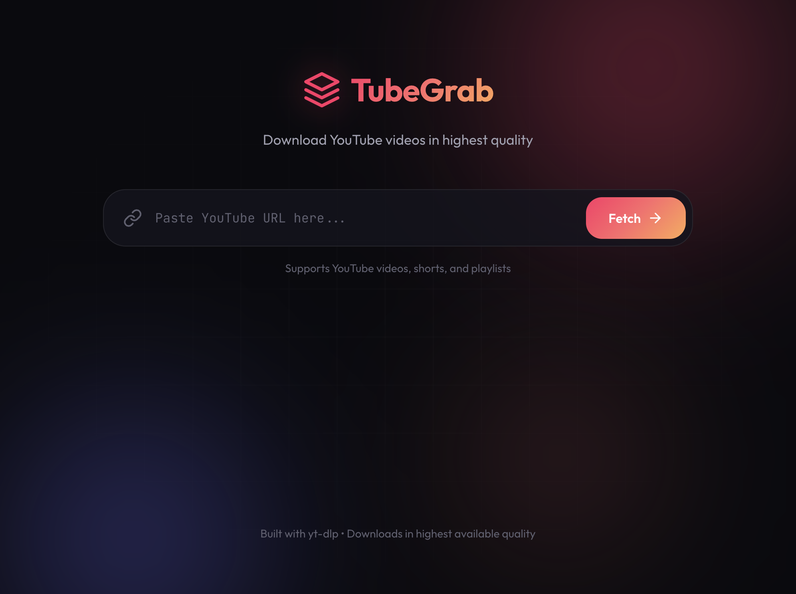

# 🎬 TubeGrab

A modern, beautiful web application to download YouTube videos in the highest available quality.



## ✨ Features

- 🎥 Download YouTube videos in highest quality (up to 4K)
- 🔄 Automatic conversion to MP4 format
- 📊 Real-time download progress tracking
- 🎨 Beautiful dark theme UI
- 🚀 Fast downloads with yt-dlp
- 📱 Responsive design

## 🛠️ Prerequisites

Before running TubeGrab, make sure you have the following installed:

- **Python 3.8+**
- **FFmpeg** - Required for video processing
- **yt-dlp** - YouTube downloader (installed via requirements)

### Installing FFmpeg

**macOS (Homebrew):**
```bash
brew install ffmpeg
```

**Ubuntu/Debian:**
```bash
sudo apt update && sudo apt install ffmpeg
```

**Windows:**
Download from [ffmpeg.org](https://ffmpeg.org/download.html) and add to PATH.

## 🚀 Installation

1. **Clone the repository:**
```bash
git clone https://github.com/PVHKR7/tubegrab.git
cd tubegrab
```

2. **Create a virtual environment:**
```bash
python -m venv venv
source venv/bin/activate  # On Windows: venv\Scripts\activate
```

3. **Install dependencies:**
```bash
pip install -r requirements.txt
```

4. **Run the application:**
```bash
python app.py
```

5. **Open your browser:**
Navigate to `http://localhost:5001`

## 🌐 GitHub Pages Deployment

TubeGrab can be deployed to GitHub Pages for a live showcase! The frontend is already set up in the `docs/` folder.

### Quick Setup:

1. **Enable GitHub Pages:**
   - Go to repository settings → Pages
   - Source: Deploy from branch `main` → folder `/docs`
   - Your site will be live at: `https://pvhkr7.github.io/tubegrab/`

2. **Deploy the Backend:**
   - GitHub Pages only serves static files, so deploy the Python backend separately
   - See [docs/DEPLOYMENT.md](docs/DEPLOYMENT.md) for detailed instructions
   - Recommended: [Render.com](https://render.com) (free tier available)

3. **Connect Frontend to Backend:**
   - After deploying backend, edit `docs/index.html`
   - Update `window.API_BASE_URL` with your backend URL

For more details, see [docs/README.md](docs/README.md).

## ⚙️ Configuration

You can configure TubeGrab using environment variables:

| Variable | Description | Default |
|----------|-------------|---------|
| `TUBEGRAB_DOWNLOAD_FOLDER` | Where to save downloaded videos | `./downloads` |
| `FFMPEG_PATH` | Path to ffmpeg binary | Auto-detected |

Example:
```bash
export TUBEGRAB_DOWNLOAD_FOLDER=/path/to/downloads
python app.py
```

## 📁 Project Structure

```
tubegrab/
├── app.py              # Flask backend
├── requirements.txt    # Python dependencies
├── templates/
│   └── index.html      # Main HTML template
├── static/
│   ├── css/
│   │   └── style.css   # Styles
│   ├── js/
│   │   └── app.js      # Frontend JavaScript
│   └── favicon.svg     # Site favicon
└── downloads/          # Downloaded videos (gitignored)
```

## 🔧 API Endpoints

| Method | Endpoint | Description |
|--------|----------|-------------|
| GET | `/` | Serve the web interface |
| POST | `/api/info` | Get video information |
| POST | `/api/download` | Start a download |
| GET | `/api/progress/<id>` | Check download progress |
| GET | `/api/file/<id>` | Download the completed file |
| DELETE | `/api/cleanup/<id>` | Clean up downloaded file |

## 🤝 Contributing

Contributions are welcome! Please feel free to submit a Pull Request.

1. Fork the repository
2. Create your feature branch (`git checkout -b feature/AmazingFeature`)
3. Commit your changes (`git commit -m 'Add some AmazingFeature'`)
4. Push to the branch (`git push origin feature/AmazingFeature`)
5. Open a Pull Request

## 📝 License

This project is licensed under the MIT License - see the [LICENSE](LICENSE) file for details.

## ⚠️ Disclaimer

This tool is for personal use only. Please respect YouTube's Terms of Service and copyright laws. Only download videos you have permission to download.

## 🙏 Acknowledgments

- [yt-dlp](https://github.com/yt-dlp/yt-dlp) - The powerful YouTube downloader
- [Flask](https://flask.palletsprojects.com/) - Web framework
- [FFmpeg](https://ffmpeg.org/) - Video processing

---

Made with ❤️ by [PVHKR7](https://github.com/PVHKR7)
